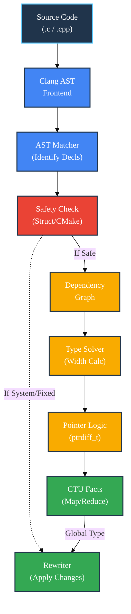

type-correct
============

[](LICENSE.md)
[](https://github.com/SamuelMarks/type-correct/actions/workflows/x86-darwin.yml)
[](https://github.com/SamuelMarks/type-correct/actions/workflows/x86-ubuntu.yml)
<!-- COVERAGE_BADGES_START -->


<!-- COVERAGE_BADGES_END -->

**type-correct** is a modern [LLVM](https://llvm.org) and [LibTooling](https://clang.llvm.org/docs/LibTooling.html)
automated refactoring solution designed to 'fix' types. It rewrites inconsistent integer usage (commonly mixed `int`,
`long`, and `size_t`) into a consistent, mathematically correct state, specifically targeting the elimination of
truncation warnings and signed/unsigned mismatches in legacy C and C++ codebases.

Unlike simple regex replacements, `type-correct` builds a dependency graph of your variables, functions, and expressions
to mathematically solve for the "widest" necessary type, ensuring global consistency across compilation units.

---

## Architectural Overview

`type-correct` functions as more than a linter; it is a constraint solver. It parses the AST (Abstract Syntax Tree),
identifies usage patterns (assignments, comparisons, pointer arithmetic), and determines the optimal type width for
every connected component in your code.



### Core Components

1. **StructAnalyzer (The Safety Gate):** Before modifying a variable, the tool determines if it is safe to change. It
   heuristically detects "System Boundaries" by:
    * Analyzing inclusion graphs (viral fixedness).
    * Scanning neighbor `CMakeLists.txt` files to blindly identify `FetchContent` or `ExternalProject` directories (
      vendored code).
    * Checking for `attribute((packed))` or bitfields which lock memory layout.
2. **TypeSolver (The Brain):** A graph-based solver that propagates type requirements. If `a = b`, and `b` must be
   `size_t`, then `a` must also be at least `size_t`. It handles:
    * **Pointer Semantics:** Variables used as array indices or in pointer arithmetic are forced to `ptrdiff_t` width (
      or `size_t`) to prevent 64-bit truncation.
    * **Symbolic Constraints:** Understanding relations like `c = a + b`.
3. **FactManager (CTU):** Handles Cross-Translation Unit analysis via a Map-Reduce approach, allowing the tool to ensure
   a function definition in `a.cpp` matches its usage in `b.cpp`.

---

## Automatic Conversions

The primary operation involves widening narrow integer types (`int`, `short`) to architecture-appropriate width types (
`size_t`, `ptrdiff_t`) based on how they are actually used.

```c
#include <string.h>

int main(void) { 

    /* FROM */ 
    const int n = strlen("FOO"); 

    /* TO: Correctly captures return type of strlen */ 
    const size_t n = strlen("FOO"); 

    /* FROM */ 
    for(int i=0; i<strlen("BAR"); i++) {} 

    /* TO: Loop index matches comparison type */ 
    for(size_t i=0; i<strlen("BAR"); i++) {} 

    /* FROM */ 
    int f(long b) { return b; } 
    static const int c = f(5); 

    /* TO: Propagation of return types */ 
    long f(long b) { return b; } 
    static const long c = f(5); 
} 
```

## Justification

Often when building third-party libraries I get a bunch of warnings "comparison between signed and unsigned types is
UB".

Not every such occurrence has a trivial solution. But—in my experience—most do. Usually switching just one var from
`int` to `size_t` also requires tracing all use of that var and changing all those types to `size_t` also. This is the
manual labor `type-correct` automates.

From:

```c
unsigned long f() {return 0;} 
const size_t v = f(); 

int main() { 
    std::vector<float> vec; 
    for(int i=0; i<vec.size(); i++) {} 
} 
```

To:

```c
unsigned long f() {return 0;} 
const unsigned long v = f(); 

int main() { 
    std::vector<float> vec; 
    for(size_t i=0; i<vec.size(); i++) {} 
} 
```

PS: I'm aware that [
`size_type`](https://github.com/llvm/llvm-project/blob/d081d75dc8fc4b5173d6b15ffcf077d2e0d4143f/libcxx/include/vector#L321)
isn't necessarily `size_t`—and that `decltype(vec)::size_type` would be more correct—but using it here anyway. Just to
reiterate: C++ is an afterthought, my main target is C.

## Integer Promotion & Truncation Safety

```c
#include <limits.h>

short sh=SHRT_MAX; 
int i=INT_MAX; 
long l=LONG_MAX; 
long long ll=LLONG_MAX; /* C99 */ 
```

Technically, these are all [defined and expected](https://en.cppreference.com/w/c/language/conversion) [on clang as an [
`ImplicitCastExpr`](https://clang.llvm.org/doxygen/classclang_1_1ImplicitCastExpr.html)]:

```c
ll = l; 
l = i; 
i = sh; 
```

(but the other
direction, '[narrowing](https://releases.llvm.org/13.0.0/tools/clang/tools/extra/docs/clang-tidy/checks/cppcoreguidelines-narrowing-conversions.html)',
is implementation defined)

However, IMHO, people doing `int sl = strlen(s);` actually want `size_t`.
This opinionated view is the assumption made for _type_correct_.

But… attempts are made to be reasonably conservative. See [
`type_correct/tests/test_type_correct.cpp`](type_correct/tests/test_type_correct.cpp) for false positive and true
positive checks.

---

## Detailed Usage

`type-correct` is built as a standalone CLI tool that consumes a compilation database or acts on single files.

### 1. Basic Audit

Before applying changes, stick to read-only "Audit Mode". This generates a change list table without touching disk.

```bash
$ type_correct_cli --audit --project-root=$(pwd) src/main.cpp
```

### 2. In-Place Refactoring

To apply changes directly to your source files:

```bash
$ type_correct_cli --in-place src/main.cpp
```

### 3. Iterative Global Analysis (CTU)

For complex projects where a header change affects multiple Translation Units (TUs), a single pass is insufficient.
`type-correct` supports an iterative "Fixed-Point Convergence" mode using a Map-Reduce strategy.

```bash
# 1. Create a directory for intermediate facts
mkdir facts

# 2. Run iteratively until types stop changing
type_correct_cli \
  --phase=iterative \
  --facts-dir=facts \
  --project-root=$(pwd) \
  --in-place \
  src/*.cpp
```

### 4. Safety Flags

By default, the tool is conservative about changing struct layouts (ABI breaking). If you are recompiling the entire
universe and want to optimize internal structs:

```bash
$ type_correct_cli --in-place --enable-abi-breaking-changes src/*.cpp
```

---

## Build Instructions

Install a C++20 compliant compiler suite, CMake, and LLVM 16+ (from `brew`, `apt`, or source).

**Dependencies:**

* CMake >= 3.20
* LLVM/Clang >= 16.0 (Required for modern LibTooling APIs)

```sh
$ mkdir build && cd build

# Point to your LLVM installation root
$ cmake .. \
  -DCMAKE_BUILD_TYPE='Debug' \
  -DCT_Clang_INSTALL_DIR='/usr/lib/llvm'

$ cmake --build .
```

(Replace `/usr/lib/llvm` with your actual LLVM install directory found via `llvm-config --prefix`; on macOS `brew` it's `-DCT_Clang_INSTALL_DIR=/opt/homebrew/opt/llvm`).

## Testing

The project uses `GoogleTest` for unit logic and `llvm-lit` for integration testing.

```sh
$ cd build
$ ctest --output-on-failure
```

## Coverage Badges

`scripts/update_coverage_badges.py` can compute documentation coverage from multiple open-source API doc generators and
update the README badges.

Supported doc sources:

* Doxygen XML (C/C++/Objective-C/C#/Java)
* JSDoc JSON (`jsdoc -X`) for JavaScript
* TypeDoc JSON (`typedoc --json`) for TypeScript
* OpenAPI specs (JSON/YAML) for REST APIs
* Custom JSON counts (`documented` + `total`)

```sh
$ python3 scripts/update_coverage_badges.py \
  --doc-source doxygen=build/docs/xml \
  --doc-source typedoc=docs/typedoc.json
```

To run coverage + doc coverage and refresh the shields in one step:

```sh
$ scripts/coverage_badges.sh [build]
```

Enable the pre-commit hook:

```sh
$ git config core.hooksPath .githooks
```

## Thanks

Boilerplate from  https://github.com/banach-space/clang-tutor

---

### License

The person who associated a work with this deed has **dedicated** the work to the public domain by waiving all of his or her rights to the work worldwide under copyright law, including all related and neighboring rights, to the extent allowed by law.

You can copy, modify, distribute and perform the work, even for commercial purposes, all without asking permission. See [Other Information](#Other%20Information) below.

#### Other Information

  - In no way are the patent or trademark rights of any person affected by CC0, nor are the rights that other persons may have in the work or in how the work is used, such as publicity or privacy rights. 
  - Unless expressly stated otherwise, the person who associated a work with this deed makes no warranties about the work, and disclaims liability for all uses of the work, to the fullest extent permitted by applicable law. 
  - When using or citing the work, you should not imply endorsement by the author or the affirmer.
